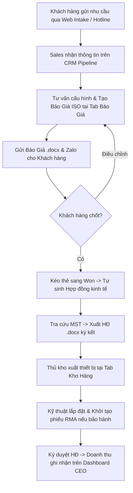

# TÀI LIỆU BÀN GIAO HỆ THỐNG & HƯỚNG DẪN VẬN HÀNH
## HỆ THỐNG TỰ ĐỘNG HÓA KINH DOANH & QUẢN TRỊ ERP — PHÚC THANH AUDIO GROUP

*Phiên bản bàn giao: 2.0 (Chính thức)*  
*Thời gian bàn giao: Tháng 09/2026*  
*Đơn vị phát triển: Antigravity AI Engineering Team*  
*Đơn vị tiếp nhận: Ban Giám Đốc & Khối Vận Hành — CÔNG TY TNHH THƯƠNG MẠI - DỊCH VỤ PHÚC THÀNH AN*

---

## 📌 MỤC LỤC
1. [Thông Tin Pháp Nhân & Hạ Tầng Triển Khai](#1-thông-tin-pháp-nhân--hạ-tầng-triển-khai)
2. [Bàn Giao Tài Khoản Quản Trị & Phân Quyền](#2-bàn-giao-tài-khoản-quản-trị--phân-quyền)
3. [Kiến Trúc Kỹ Thuật Hệ Thống (Architecture)](#3-kiến-trúc-kỹ-thuật-hệ-thống)
4. [Hướng Dẫn Sử Dụng Chi Tiết 8 Phân Hệ Nghiệp Vụ](#4-hướng-dẫn-sử-dụng-chi-tiết-8-phân-hệ-nghiệp-vụ)
   - [NV1: Quản Lý & Soạn Thảo Hợp Đồng Kinh Tế](#nv1-quản-lý--soạn-thảo-hợp-đồng-kinh-tế)
   - [NV2: Lập Báo Giá Dự Án Thiết Bị Âm Thanh](#nv2-lập-báo-giá-dự-án-thiết-bị-âm-thanh)
   - [NV3: Quản Lý Khách Hàng & Cơ Hội Bán Hàng (CRM Pipeline)](#nv3-quản-lý-khách-hàng--cơ-hội-bán-hàng-crm-pipeline)
   - [NV4: Thông Báo Tự Động Khách Hàng Qua Zalo (ZNS / ZBS)](#nv4-thông-báo-tự-động-khách-hàng-qua-zalo-zns--zbs)
   - [NV5: Dịch Vụ Tiếp Nhận & Bảo Hành Thiết Bị (RMA)](#nv5-dịch-vụ-tiếp-nhận--bảo-hành-thiết-bị-rma)
   - [NV6: Quản Lý Kho & Cảnh Báo Tồn Hàng Dự Trữ](#nv6-quản-lý-kho--cảnh-báo-tồn-hàng-dự-trữ)
   - [NV7: Báo Cáo Điều Hành & Biểu Đồ Doanh Thu (CEO Dashboard)](#nv7-báo-cáo-điều-hành--biểu-đồ-doanh-thu-ceo-dashboard)
   - [NV8: Cổng Tiếp Nhận Tư Vấn Khách Hàng Công Cộng (Public Intake)](#nv8-cổng-tiếp-nhận-tư-vấn-khách-hàng-công-cộng-public-intake)
5. [Quy Trình Chuẩn Vận Hành Hàng Ngày (SOP)](#5-quy-trình-chuẩn-vận-hành-hàng-ngày-sop)
6. [Hướng Dẫn Quản Trị Hệ Thống, Sao Lưu & Bảo Trì Server](#6-hướng-dẫn-quản-trị-hệ-thống-sao-lưu--bảo-trì-server)
7. [Biên Bản Xác Nhận Bàn Giao](#7-biên-bản-xác-nhận-bàn-giao)

---

## 1. THÔNG TIN PHÁP NHÂN & HẠ TẦNG TRIỂN KHAI

### 1.1. Thông Tin Pháp Nhân Chuẩn Hóa Trên Toàn Hệ Thống
Toàn bộ phôi tài liệu Word (.docx), báo giá, hợp đồng và API đã được liên kết đồng bộ với pháp nhân chính thức của công ty:
- **Tên Doanh Nghiệp:** CÔNG TY TNHH THƯƠNG MẠI - DỊCH VỤ PHÚC THÀNH AN
- **Thương Hiệu Giao Dịch:** Phúc Thanh Audio Group / Siêu Thanh Audio
- **Mã Số Thuế (MST):** `0301719729`
- **Địa Chỉ Đăng Ký Trụ Sở:** P.910, Tầng 9, Tòa nhà Mapletree Business Centre, 1060 Nguyễn Văn Linh, Phường Tân Hưng, TP. Hồ Chí Minh
- **Đại Diện Pháp Luật:** Ông Đinh Quang Phong — Giám Đốc
- **Hotline Hỗ Trợ:** `0909 787 040` — `0934 635 766`
- **Hộp Thư Điện Tử:** `phucthanhaudio@gmail.com`
- **Website Chính Thức:** `https://phucthanhaudio.vn`

### 1.2. Đường Dẫn Truy Cập Hệ Thống (Production URLs)
| Hạng Mục | Đường Dẫn (URL) | Mục Đích Sử Dụng |
|---|---|---|
| **Cổng Quản Trị Web ERP** | `https://phucthanhaudio.wiai.vn/` | Dành cho Ban Giám Đốc, Kế toán, Sales, Kỹ thuật viên, Thủ kho đăng nhập làm việc |
| **Cổng Tiếp Nhận Khách Hàng** | `https://phucthanhaudio.wiai.vn/intake` | Form đăng ký tư vấn giải pháp âm thanh công cộng gửi khách hàng hoặc nhúng vào website |
| **Cổng Dịch Vụ API Backend** | `https://apiphucthanhaudio.wiai.vn/` | Máy chủ xử lý dữ liệu FastAPI, sinh tài liệu Word, tra MST |
| **Tài Liệu Kỹ Thuật Swagger API** | `https://apiphucthanhaudio.wiai.vn/docs` | Tra cứu chi tiết từng endpoint, payload JSON phục vụ tích hợp |
| **Cơ Sở Dữ Liệu Airtable Cloud** | `https://airtable.com/applSd5Z3mQyCsKxN` | Cơ sở dữ liệu đám mây 10 bảng đồng bộ 2 chiều |
| **Kho Lưu Trữ Mã Nguồn GitHub** | `https://github.com/Ryhtruly/PhucThanhAudio` | Quản lý mã nguồn, tự động deploy qua CI/CD GitHub Actions |

---

## 2. BÀN GIAO TÀI KHOẢN QUẢN TRỊ & PHÂN QUYỀN

### 2.1. Tài Khoản Quản Trị Viên Cấp Cao (Admin Master)
Hệ thống sử dụng cơ chế xác thực JWT kết hợp mã hóa bảo mật:
- **Tài khoản đăng nhập:** `admin@phucthanhaudio.vn`
- **Mật khẩu khởi tạo:** `PhucThanh@` *(Khuyến cáo Ban Giám Đốc đổi mật khẩu ngay sau khi tiếp nhận bàn giao tại mục Cài đặt)*
- **Quyền hạn:** Toàn quyền kiểm soát hệ thống (Xem báo cáo tài chính doanh thu, ký duyệt hợp đồng, xuất hóa đơn, thêm/sửa/xóa thiết bị trong kho, phân công nhân sự).

### 2.2. Ma Trận Phân Quyền Nhân Sự Theo Vai Trò
| Vai Trò | Nhân Sự Mẫu | Phân Hệ Được Truy Cập | Trách Nhiệm Chính |
|---|---|---|---|
| **Ban Giám Đốc (CEO / Admin)** | Đinh Quang Phong | Toàn bộ 8 phân hệ | Theo dõi KPI, duyệt hợp đồng, quyết định mức chiết khấu |
| **Kỹ Sư Bán Hàng (Sales Rep)** | Nguyễn Văn Tuấn | Báo giá, Hợp đồng, CRM Lead | Lập báo giá, theo dõi phễu khách hàng, sinh hợp đồng |
| **Kỹ Thuật Viên (Technician)** | Trần Minh Đức | Dịch vụ & Bảo hành (RMA) | Tiếp nhận thiết bị sửa chữa, cập nhật biên bản hoàn thành |
| **Thủ Kho (Warehouse Staff)** | Nguyễn Văn Nam | Kho hàng & Thiết bị | Quản lý SKU, thực hiện nhập/xuất kho, theo dõi định mức tồn |

---

## 3. KIẾN TRÚC KỸ THUẬT HỆ THỐNG

```
[Khách Hàng / Nhân Viên]
        │
        ├──► Web ERP Frontend (React 18 + Vite + Glassmorphism UI)
        │       │
        │       ▼
        ├──► Backend API Gateway (FastAPI 0.111 + Python 3.11/3.12)
        │       ├── Redis Cache Engine (Tối ưu tốc độ phản hồi < 50ms)
        │       ├── SQLite Database (phucthanh.db - Lưu trữ nội bộ an toàn)
        │       ├── Airtable Cloud Base (applSd5Z3mQyCsKxN - Đồng bộ đám mây)
        │       ├── Document Generator (python-docx - Xuất văn bản .docx chuẩn)
        │       ├── VietQR & MST API (Tự động tra cứu mã số thuế doanh nghiệp)
        │       └── Zalo ZBS / ZNS Gateway (Gửi thông báo tự động tới khách hàng)
```

- **Lưu trữ dữ liệu 3 tầng (Triple-layer Redundancy):**
  1. *SQLite Local:* Đảm bảo hệ thống vẫn hoạt động siêu tốc ngay cả khi mất kết nối mạng Internet.
  2. *Redis In-memory:* Tự động cache các danh sách Hợp đồng, Báo giá, KPI; tự động xóa cache (invalidation) ngay khi có giao dịch mới phát sinh.
  3. *Airtable Cloud:* Đồng bộ 2 chiều để khối văn phòng có thể xem và cộng tác trực tiếp trên bảng biểu Google Sheets / Airtable.
- **Hệ thống sinh tài liệu thông minh:**
  Tự động thay thế hàng trăm placeholder, tự động chuyển đổi số tiền thành chữ tiếng Việt chuẩn xác (ví dụ: *Hai trăm bảy mươi lăm triệu đồng chẵn*), tự động canh lề bảng sản phẩm và điền đầy đủ thông tin pháp nhân Phúc Thanh Audio.

---

## 4. HƯỚNG DẪN SỬ DỤNG CHI TIẾT 8 PHÂN HỆ NGHIỆP VỤ

### NV1: Quản Lý & Soạn Thảo Hợp Đồng Kinh Tế
*Vị trí trên thanh điều hướng:* **Quản Lý Hợp Đồng**

#### Các bước tạo hợp đồng mới:
1. Nhập **Mã số thuế bên mua** (ví dụ: `0301719729`, `0101248141`,...) và bấm nút **"Tra Cứu Pháp Nhân"**.
   - *Hệ thống tự động điền Tên doanh nghiệp và Địa chỉ trụ sở từ Cơ sở dữ liệu Quốc gia.*
2. Nhập **Số điện thoại** người ký và lựa chọn **Loại hợp đồng** (Cung cấp thiết bị / Lắp đặt trọn gói Karaoke VIP / Âm thanh hội thảo...).
3. Nhập **Giá trị hợp đồng** và cấu hình **Thuế VAT**:
   - Tích chọn hoặc bỏ chọn *Xuất hóa đơn thuế GTGT (VAT)*.
   - Chọn mức thuế suất linh hoạt: **`10% (Chuẩn)`**, **`8% (Ưu đãi)`**, **`5%`**, **`0%`** hoặc gõ số % tự do.
   - Chọn phương thức tính: **"Giá chưa thuế (+ X% VAT)"** hoặc **"Giá trọn gói (Đã gồm VAT)"**.
   - Bảng tính tiền minh bạch (*Live Breakdown*) sẽ tự động bóc tách doanh thu thuần trước thuế và tiền thuế tương ứng.
4. Bấm **"Tạo Hợp Đồng & Tải File (.docx)"**:
   - Hệ thống tự sinh mã chuẩn duy nhất `HD-YYYYMMDD-HHMMSSxxx`.
   - File Word `.docx` hoàn chỉnh được tự động tải về máy tính để in ấn hoặc trình ký.
5. **Ký duyệt hợp đồng:** Tại danh sách bên dưới, bấm nút **"Ký Duyệt"** đối với các hợp đồng đã hoàn tất ký kết để hệ thống chuyển trạng thái sang `Đã ký` và ghi nhận Doanh thu thực đạt vào sổ sách kế toán.
6. **Bộ lọc & Sắp xếp:** Sử dụng thanh công cụ tìm kiếm theo Mã HĐ, tên công ty, MST; lọc trạng thái Chờ ký / Đã ký; mặc định danh sách luôn **sắp xếp hợp đồng mới nhất lên hàng đầu**.

---

### NV2: Lập Báo Giá Dự Án Thiết Bị Âm Thanh
*Vị trí trên thanh điều hướng:* **Báo Giá Dự Án**

#### Các bước lập báo giá tiêu chuẩn ISO:
1. Nhập thông tin khách hàng tại khung bên trái: Tên công ty, Người liên hệ, SĐT, Tên dự án.
2. Tại khung **Danh Mục Thiết Bị**, bấm chọn các sản phẩm cần đưa vào báo giá (Loa sân khấu SR Italy, Cục đẩy công suất Crown, Vang số, Micro,...).
3. Tại khung **Chi Tiết Báo Giá**:
   - Điều chỉnh số lượng tăng/giảm bằng nút `+` hoặc `-`.
   - Bấm biểu tượng thùng rác để xóa sản phẩm khỏi cấu hình nếu cần.
4. Cấu hình **Thuế VAT**:
   - Tích chọn *Xuất Hóa Đơn Thuế GTGT (VAT)*.
   - Chọn mức thuế: `10%`, `8%`, `5%`, `0%` hoặc tự nhập số % mong muốn.
   - Hệ thống tự động tính: Cộng tiền hàng ➔ Thuế GTGT (VAT X%) ➔ Tổng thanh toán.
5. Bấm **"Lưu & Xuất Báo Giá (.docx)"**:
   - Hệ thống tự cấp mã báo giá dạng `BG-YYYYMMDD-HHMMSSxxx`.
   - File văn bản Báo giá chuẩn ISO tự động tải về với đầy đủ thông tin pháp nhân Phúc Thanh (MST `0301719729`, Hotline, Địa chỉ trụ sở, Email, Website) — tuyệt đối không còn trường `[để trống]`.
6. **Quản lý danh sách báo giá:** Phía dưới có thanh tìm kiếm theo tên dự án, khách hàng, số điện thoại và nút xem/tải lại file Word bất kỳ lúc nào.

---

### NV3: Quản Lý Khách Hàng & Cơ Hội Bán Hàng (CRM Pipeline)
*Vị trí trên thanh điều hướng:* **Khách Hàng & Cơ Hội**

- **Giao diện bảng Kanban 5 cột chuẩn quốc tế:**
  1. `Khách Hàng Mới (New)` — Nhu cầu mới tiếp nhận.
  2. `Đã Thẩm Định (Qualified)` — Đã khảo sát mặt bằng, xác định ngân sách.
  3. `Đang Đàm Phán (Dam phan)` — Đang gửi báo giá và chốt phương án kỹ thuật.
  4. `Chốt Thành Công (Won)` — Khách đồng ý ký kết.
  5. `Thất Bại (Lost)` — Hủy dự án hoặc chuyển đơn vị khác.
- **Tính năng tự động sinh Hợp đồng (Won ➔ Contract Automation):**
  Khi kéo thả thẻ khách hàng từ bất kỳ cột nào sang cột **"Chốt Thành Công (Won)"**, hệ thống tự động:
  - Khởi tạo ngay 1 Hợp đồng kinh tế mới trong CSDL.
  - Cập nhật doanh thu dự án vào phễu tài chính.
  - Gửi thông báo chúc mừng tới bộ phận kinh doanh.
- Bấm **"+ Thêm Khách Hàng Mới"** để tạo hồ sơ khách hàng thủ công khi tiếp nhận qua điện thoại.

---

### NV4: Thông Báo Tự Động Khách Hàng Qua Zalo (ZNS / ZBS)
*Vị trí trên thanh điều hướng:* **Thông Báo Zalo (ZNS)**

- Tích hợp cổng kết nối Zalo Notification Service (ZBS WIFIM):
  - Gửi thông báo hợp đồng đã phát hành kèm liên kết tải file.
  - Gửi thông báo báo giá dự án gửi tới số điện thoại khách hàng.
  - Gửi thông báo lịch hẹn bảo hành, bảo trì định kỳ hệ thống âm thanh.
- Cho phép kiểm tra trạng thái gửi tin theo thời gian thực (Đã gửi, Đang xử lý, Thất bại).

---

### NV5: Dịch Vụ Tiếp Nhận & Bảo Hành Thiết Bị (RMA)
*Vị trí trên thanh điều hướng:* **Dịch Vụ & Bảo Hành**

- Quản lý toàn diện vòng đời sửa chữa, bảo hành thiết bị âm thanh:
  - Tiếp nhận thiết bị: Tên thiết bị, Số Serial, Tên khách hàng, Hiện tượng lỗi, Mức độ ưu tiên (Thường / Gấp).
  - Phân công kỹ thuật viên phụ trách (Trần Minh Đức, Lê Hoàng Nam,...).
  - Cập nhật tiến độ xử lý và bấm **"Hoàn thành"** khi đã nghiệm thu bàn giao lại cho khách.
- Dữ liệu phiếu bảo hành tự động liên kết với Form đăng ký công cộng tại `/intake`.

---

### NV6: Quản Lý Kho & Cảnh Báo Tồn Hàng Dự Trữ
*Vị trí trên thanh điều hướng:* **Kho Hàng & Thiết Bị**

- **Quản lý danh mục thiết bị:** Mã SKU (dạng `PT-xxxx`), Tên thiết bị, Thương hiệu, Đơn vị tính, Giá nhập vốn, Giá bán niêm yết, Số lượng tồn, Ngưỡng tồn tối thiểu.
- **Thanh tìm kiếm & Bộ lọc kho thông minh:**
  - Tìm nhanh theo tên thiết bị, mã SKU hoặc thương hiệu (SR Italy, Crown, JBL,...).
  - Lọc theo tình trạng: *Tất cả*, *Cần nhập gấp* (Tồn dưới mức tối thiểu), *Hết hàng* (Tồn = 0), *Tồn an toàn*.
  - Lọc theo phân loại: Loa, Cục đẩy công suất, Vang số / DSP, Micro,...
  - Sắp xếp theo số lượng tồn tăng dần/giảm dần, tổng giá trị tồn kho.
- **Thao tác nhanh:**
  - **Nhập/Xuất kho:** Bấm nút "Nhập/Xuất" trên từng dòng sản phẩm để cộng/trừ số lượng kèm ghi chú lý do.
  - **Sửa thiết bị:** Cập nhật lại giá bán, giá nhập, định mức an toàn.
  - **Xóa thiết bị:** Xóa thiết bị thử nghiệm ra khỏi hệ thống chỉ với 1 click.
  - **Thêm thiết bị mới:** Bấm "+ Thêm Thiết Bị Mới" để mở rộng danh mục hàng hóa.

---

### NV7: Báo Cáo Điều Hành & Biểu Đồ Doanh Thu (CEO Dashboard)
*Vị trí trên thanh điều hướng:* **Tổng Quan Điều Hành**

- **Báo cáo chuẩn tài chính 3 tầng minh bạch:**
  1. **Doanh thu thuần thực đạt:** Tổng giá trị các hợp đồng đã ký kết chính thức và bàn giao.
  2. **Dự thu Pipeline:** Tổng giá trị các hợp đồng đang chờ ký duyệt hoặc cơ hội bán hàng tiềm năng.
  3. **Tổng quy mô kinh doanh:** Tổng hợp toàn bộ nguồn vốn dự án đang vận hành.
- **Biểu đồ xu hướng doanh thu (Spline Area Chart):**
  - Trực quan hóa đường cong doanh thu thực tế so sánh với đường chỉ tiêu doanh số hàng tháng.
- **Bộ lọc động cho Ban Giám Đốc:**
  - *Góc nhìn doanh số:* Chuyển đổi linh hoạt giữa "Toàn bộ quy mô", "Doanh thu thực đạt (HĐ Đã ký)", "Dự thu pipeline (HĐ Chờ ký)".
  - *Kỳ báo cáo:* Lọc riêng theo Tháng 9/2026, Tháng 8/2026 hoặc toàn bộ các kỳ.
  - Khi thay đổi bộ lọc, thẻ KPI và biểu đồ sẽ tự động chuyển động cập nhật số liệu tương ứng.

---

### NV8: Cổng Tiếp Nhận Tư Vấn Khách Hàng Công Cộng (Public Intake)
*Đường dẫn truy cập trực tiếp:* `https://phucthanhaudio.wiai.vn/intake`

- Giao diện thiết kế theo phong cách hiện đại (Dark Glassmorphism, Responsive trên điện thoại di động):
  - Khách hàng tự chọn nhóm nhu cầu: Karaoke VIP kinh doanh, Âm thanh sân khấu / Hội trường ngoài trời, Bar / Vũ trường / Lounge cao cấp, Hệ thống PA Cafe & Nhà hàng.
  - Khách hàng nhập tên đơn vị, người liên hệ, số điện thoại, ngân sách dự kiến và yêu cầu kỹ thuật.
- Khi khách hàng bấm **"Gửi Yêu Cầu Tư Vấn & Báo Giá"**:
  - Dữ liệu tức thì chuyển về CSDL Backend và tạo mới một thẻ tại cột `Khách Hàng Mới (New)` trên CRM Pipeline.
  - Nhân viên kinh doanh nhận được thông tin để liên hệ tư vấn trong vòng 15 phút.

---

## 5. QUY TRÌNH CHUẨN VẬN HÀNH HÀNG NGÀY (SOP)



---

## 6. HƯỚNG DẪN QUẢN TRỊ HỆ THỐNG, SAO LƯU & BẢO TRÌ SERVER

### 6.1. Quản Lý Dịch Vụ Bằng Docker
Hệ thống được đóng gói hoàn chỉnh bằng Docker Compose, triển khai tại máy chủ Linux/Windows:

- **Khởi động toàn bộ hệ thống:**
  ```bash
  docker compose up -d
  ```
- **Kiểm tra trạng thái các container:**
  ```bash
  docker compose ps
  ```
- **Xem nhật ký hoạt động (Logs):**
  ```bash
  docker compose logs -f backend
  docker compose logs -f frontend
  ```
- **Khởi động lại một dịch vụ:**
  ```bash
  docker compose restart backend
  ```

### 6.2. Sao Lưu Cơ Sở Dữ Liệu (Backup Database)
Tệp cơ sở dữ liệu SQLite được lưu tại `backend/phucthanh.db`.
- **Lệnh sao lưu thủ công:**
  ```bash
  # Tạo bản sao lưu kèm mốc thời gian
  cp backend/phucthanh.db backend/backups/phucthanh_$(date +%Y%m%d_%H%M%S).db
  ```
- Định kỳ hàng tuần tải bản sao lưu về ổ cứng an toàn của công ty hoặc lưu trữ đám mây Google Drive.

### 6.3. Quy Trình Cập Nhật Mã Nguồn (CI/CD)
Hệ thống đã được thiết lập quy trình tích hợp liên tục:
Mỗi khi có commit được đẩy lên nhánh `main` của kho lưu trữ GitHub (`https://github.com/Ryhtruly/PhucThanhAudio`), GitHub Actions sẽ tự động kiểm thử build và cập nhật phiên bản mới lên máy chủ mà không làm gián đoạn thời gian hoạt động.

---

## 7. BIÊN BẢN XÁC NHẬN BÀN GIAO

Hệ thống được xác nhận bàn giao đầy đủ, hoạt động ổn định, chính xác về số liệu kế toán và mẫu văn bản:

| ĐẠI DIỆN BÊN BÀN GIAO | ĐẠI DIỆN BÊN TIẾP NHẬN |
|:---:|:---:|
| *(Đã ký & Chuyển giao)* | *(Đã nghiệm thu)* |
| **Kỹ Sư Trưởng Dự Án** | **Ban Giám Đốc Phúc Thanh Audio** |
